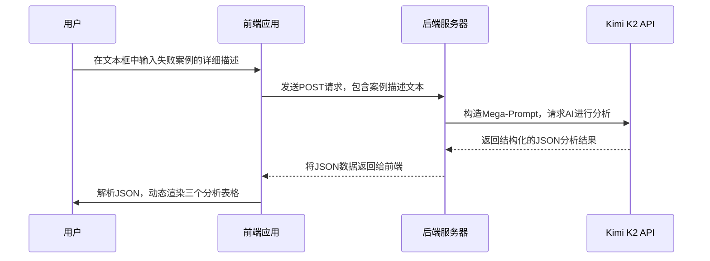

好的，遵照您的要求，并参考您提供的`func14.md`文件格式，我为您生成一份用于“聪明的失败者”AI工具开发的详细技术设计文档。

---

# AI赋能“聪明的失败者”复盘工具 - 技术设计文档

## 1. 项目目标

本项目旨在将静态的PPT模板“工具20：做一个聪明的失败者”转化为一个智能化的Web应用。该工具将利用大语言模型（LLM，如此处的Kimi K2）的自然语言处理和分析能力，让用户仅通过输入一段描述性文本，就能自动生成一份结构化的失败业务拓展案例分析报告、可执行的跟进计划以及未来机会的预警信号。

## 2. 系统架构与流程

系统将遵循一个清晰的“输入 -> AI处理 -> 输出”工作流。

1.  **前端 (用户界面)**: 用户在文本框中详细描述一次失败的业务拓展经历。
2.  **后端 (AI核心)**: 后端服务接收到文本后，构建一个包含详细指令的“超级提示词”(Mega-Prompt)，并将其与用户文本一同发送给Kimi K2 API。
3.  **LLM处理**: Kimi大模型根据指令，对输入的案例进行深度分析、归纳和总结，并按照预设的JSON格式返回结构化数据。
4.  **前端 (结果呈现)**: 前端接收到后端传回的JSON数据，解析并动态渲染到与PPT中完全一致的三个分析表格中。



## 3. 用户交互界面 (UI)

UI设计应注重简洁与引导性，核心元素如下：

*   **输入区**:
    *   一个大型文本区域 (`<textarea>`)，并附有引导性提示文字 (placeholder)：“请详细描述这次失败的业务拓展经历，包括我方产品、客户情况、竞争对手、关键决策者、沟通过程、以及最终的失败原因...”
*   **操作区**:
    *   一个按钮：“开始AI复盘分析”
*   **输出区**:
    *   页面下方为三个独立的区域，分别对应PPT中的三个表格：“工作表：分析失败的业务拓展”、“练习表：业务拓展失败后如何跟进（短期）”和“练习表：业务拓展失败后如何跟进（长期与机会）”。初始状态为空白。

## 4. AI核心：API调用与提示词工程 (Prompt Engineering)

这是项目的技术心脏。一个设计精良的“超级提示词”是保证输出质量的关键。

### 4.1 API请求数据结构 (Input JSON)

```json
{
  "case_description": "用户输入的关于失败案例的完整描述文本..."
}
```

### 4.2 核心提示词 (The Mega-Prompt)

```text
# ROLE:
你是一位顶级的销售策略复盘专家和商业分析师。你擅长从复杂的失败案例描述中，精准地识别出关键影响因素，提炼出深刻的教训，并制定出面向未来的、可执行的行动计划。

# CONTEXT:
我将为你提供一段关于我最近一次业务拓展失败的详细描述。我需要你帮助我，以一个“聪明的失败者”的视角，对这次经历进行一次彻底的、结构化的复盘。

# TASK:
请严格按照以下三个步骤，对用户提供的案例描述进行分析，并利用你的专业知识进行补充和判断。

1.  **根本原因分析 (Root Cause Analysis)**:
    *   仔细阅读案例，识别出影响本次业务拓展成败的所有关键因素（至少包括：产品特征、价格、条件和条款、竞争对手、时间框架、决策者变化等）。
    *   为每个因素判断其在此次案例中是正面影响(+)还是负面影响(-)。
    *   用一句话精炼地解释该因素为什么会产生这种影响。
    *   基于以上分析，为每个因素总结出一条最具操作性的教训。

2.  **跟进行动计划 (Follow-up Action Plan)**:
    *   基于案例的背景，智能判断在业务失败后，最应该立即执行的短期行动是什么，并给出建议的执行时机。
    *   为了与客户建立长期关系，从更长远的角度，建议应采取哪些维系关系的行动，并给出具体的操作建议（例如：寄送什么主题的材料）。

3.  **未来机会识别 (Opportunity Signal Identification)**:
    *   根据案例信息，预测哪些信号或迹象的出现，可能意味着新的合作机会再次到来。并建议一个合适的跟进或观察频率。

# OUTPUT FORMAT:
请务必、严格地以一个完整的JSON对象格式返回你的所有分析结果，不要包含任何JSON格式之外的解释性文字。JSON结构如下：

{
  "failure_analysis": [
    {
      "factor": "产品特征",
      "impact": "positive" | "negative",
      "explanation": "...",
      "lesson": "..."
    },
    {
      "factor": "价格",
      "impact": "positive" | "negative",
      "explanation": "...",
      "lesson": "..."
    }
  ],
  "follow_up_plan": {
    "immediate_actions": [
      {
        "action": "打电话以了解这个决定的原委，并让机会大门继续打开。",
        "is_selected": true | false,
        "timing_suggestion": "建议的执行时机..."
      },
      {
        "action": "问一下客户是如何评价竞争对手的产品的。",
        "is_selected": true | false,
        "timing_suggestion": "..."
      }
    ],
    "long_term_relations": [
      {
        "action": "向客户寄送以下主题的材料(...)",
        "is_selected": true | false,
        "details_suggestion": "关于...的行业白皮书或成功案例。"
      }
    ]
  },
  "opportunity_signals": [
    {
      "signal": "客户中新的购买者",
      "is_relevant": true | false,
      "timing_suggestion": "持续关注其领英动态"
    },
    {
      "signal": "客户对竞争对手的产品不满意",
      "is_relevant": true | false,
      "timing_suggestion": "重点在6个月后的跟进中了解"
    }
  ]
}
```

### 4.3 API返回数据结构 (Output JSON)

后端服务应将LLM返回的JSON直接透传给前端。前端开发者可依据此稳定结构进行开发。

## 5. 前端渲染逻辑

1.  在发送API请求后，显示加载动画。接收到数据后，隐藏动画。
2.  **渲染表格1 (分析失败的业务拓展)**:
    *   遍历 `failure_analysis` 数组。数组中的每个对象代表表格的一行。
    *   根据 `impact` 字段的值，在“+”或“-”列中打上标记 (e.g., ✅)。
    *   将 `factor`, `explanation`, `lesson` 的值填入对应单元格。
3.  **渲染表格2 (业务拓展失败后如何跟进)**:
    *   遍历 `follow_up_plan.immediate_actions` 和 `follow_up_plan.long_term_relations` 数组。
    *   根据 `is_selected` 字段 (true/false) 来决定是否勾选每一项前面的复选框。
    *   将 `timing_suggestion` 或 `details_suggestion` 的值填入“何时”或说明列。
4.  **渲染表格3 (新的合作机会指征/迹象)**:
    *   遍历 `opportunity_signals` 数组。
    *   根据 `is_relevant` 字段来决定是否高亮或勾选该项。
    *   将 `signal` 和 `timing_suggestion` 的值填入对应列。


## 6. 重要表格展现形式

### 表格1: 工作表：分析失败的业务拓展

| 因素 | + | - | 正面或负面影响的具体说明 | 所吸取的教训 |
| :--- | :-: | :-: | :--- | :--- |
| **产品特征** | | | | |
| **价格** | | | | |
| **条件和条款** | | | | |
| **竞争对手** | | | | |
| **时间框架** | | | | |
| **新的/不同的决策者** | | | | |
| **其他** | | | | |

---

### 表格2: 练习表：业务拓展失败后如何跟进

| 业务拓展失败后，我会： | 何时 |
| :--- | :--- |
| ☐ 打电话以了解这个决定的原委，并让机会大门继续打开。 | |
| ☐ 问一下客户是如何评价竞争对手的产品的。 | |
| ☐ 在客户内部或外部寻找推荐人-并确定以后是否还有合作的可能性。 | |
| ☐ 在3-6个月内跟进拜访，确定客户对于目前供应商的满意度。 | |
| **为了与客户建立长期的关系，我会：** | |
| ☐ 向客户寄送以下主题的材料(与客户业务问题及其赢得市场领导地位相关的)： | |
| ☐ 向客户推荐能向客户提供咨询建议的同事。可能的人选： | |
| ☐ 邀请关键人物加盟客户服务小组。可能的关键人物： | |
| ☐ 了解客户所在市场的情况。 | |
| ☐ 其他： | |
| **新的合作机会指征/迹象：** | |
| ☐ 新的或改进的产品 | |
| ☐ 客户中新的购买者 | |
| ☐ 客户对竞争对手的产品不满意 | |
| ☐ 客户的业务形势发生了变化(例如出现了新的竞争对手) | |
| ☐ 得到了适用于该客户的新的证明和推荐人 | |
| ☐ 其他： | |